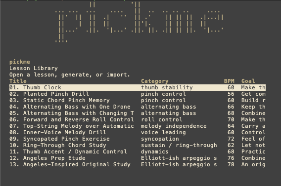
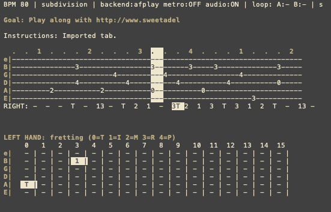

# pickme - Fingerpicking Guitar Trainer

A terminal-based guitar fingerpicking practice application for macOS.




## Version History

### v2.4.0 (current)
- Packaged as a standard Python project (via `pyproject.toml`).
- Implemented real-time tone synthesis (`synth` backend) using `numpy` and `sounddevice`, defaulting to it when available.
- Embedded terminal ASCII logo.
- Multiple audio backend support: synth, pygame, sounddevice, simpleaudio, afplay
- Select audio backend via --audio-backend flag
- Left hand finger display on fretboard (which finger to fret)
- Right hand finger display under tab (which finger to pluck)

### v2.3
- Initial pygame.mixer implementation (audio issues)
- Basic fretboard display

### v2.0-2.2
- Development iterations with Gemini AI

### v1.0
- Initial concept

## Features

### Current Features
- **Lesson Library**: 13 built-in lessons
- **Lesson Generator**: Create custom drills
- **Tab Importer**: Import guitar tabs
- **Playback**: Variable speed with loop markers
- **Audio**: Real-time synthesis via the `synth` backend, along with multiple fallback backends.
- **Finger Tracking**: Left/right hand display

### Planned Features
- [ ] Save/load user preferences
- [ ] Metronome customization
- [ ] Progress tracking
- [ ] Export lessons to PDF
- [ ] MIDI input support
- [ ] Recording feature

## Installation

You can install `pickme` directly from the repository using pip:

```bash
pip install -e .
```

This will also automatically install the required `sounddevice` and `numpy` dependencies.

## Usage

```bash
pickme
pickme --audio-backend synth
pickme --audio-backend pygame
pickme --audio-backend simpleaudio
pickme --audio-backend afplay
```

## Audio Backends

| Backend | Dependencies |
|---------|-------------|
| auto | sounddevice, numpy (defaults to synth) |
| synth | sounddevice, numpy |
| pygame | pygame |
| sounddevice | sounddevice, numpy |
| simpleaudio | simpleaudio |
| afplay | none |

## TODO (Smart Tab Parsing Features)

- **Chord Shape Stripping:** Auto-detect and strip standalone chord shapes/definitions that often appear at the top of online tabs.
- **Dual-line Tab Support:** Parse dual-line tabs (e.g., where line 1 shows chord shapes like `G`, `Bm` and line 2 shows exact fingerpicking patterns) and align them so full chord shapes are rendered as text above the tab.
- **Chord Shape Display:** When explicitly provided in the tab text, include chord names directly above the rendered UI.
- **Smart Chord Auto-generation:** Analyze the tabbed fingerpicking notes and automatically deduce and display the name of the underlying chord shape. This heuristic must be wise enough to avoid generating noise (e.g., not calling every 3-note combo a weird chord).
- **Lyrics Alignment:** Parse and extract lyrics text that is often interleaved between tab blocks, and intelligently align them within the lesson player UI.

## License

MIT
